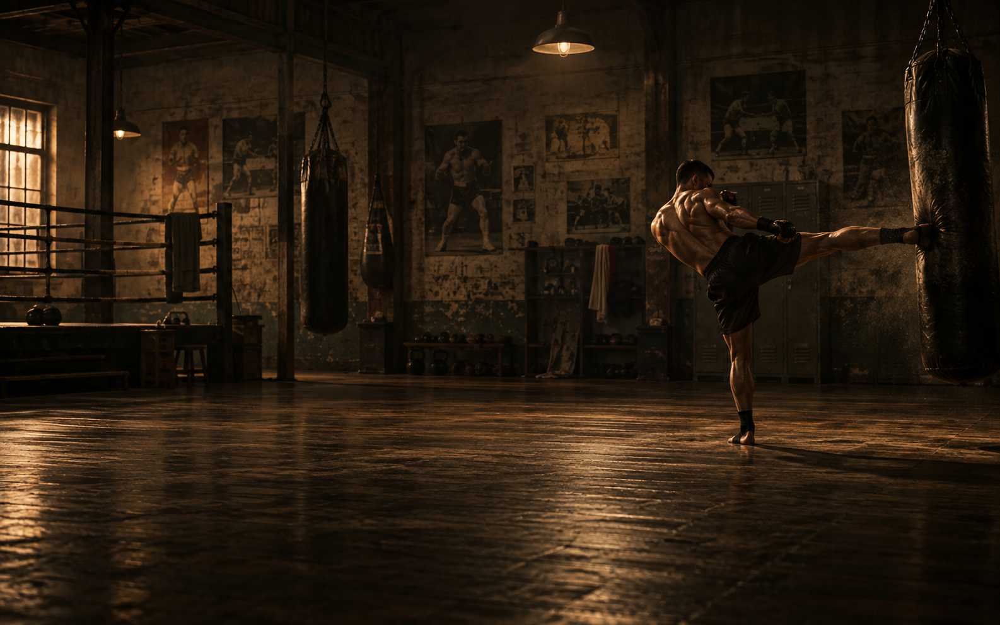

# Omarchy MMA Theme

MMA Vibrant: a dark Omarchy theme with charcoal backgrounds, bright amber accents, and contrasting athletic colours.



## Install

```bash
omarchy theme install https://github.com/dtt101/omarchy-mma-theme
```

## Palette

| Role | Hex |
| --- | --- |
| Background | `#111518` |
| Dark background | `#0c1013` |
| Surface | `#20292f` |
| Foreground | `#eeeae2` |
| Amber accent | `#ffb340` |
| Red | `#ff6b68` |
| Green | `#a6d879` |
| Cyan | `#53d6c7` |
| Blue | `#71b7f4` |
| Magenta | `#d899e9` |

The complete palette is in [`colors.toml`](colors.toml). Omarchy generates application configurations from this palette using its installed theme templates. 

## Contents

- `colors.toml`: the MMA Vibrant palette.
- `backgrounds/mma.png`: the wallpaper 

See [`LICENSE.md`](LICENSE.md) and [`CREDITS.md`](CREDITS.md) for licensing and asset notes.
