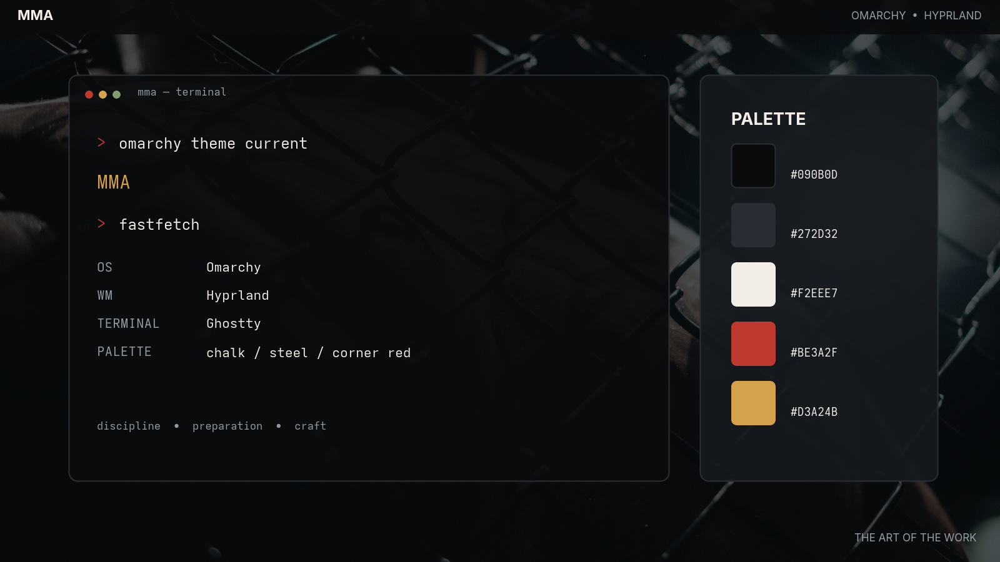
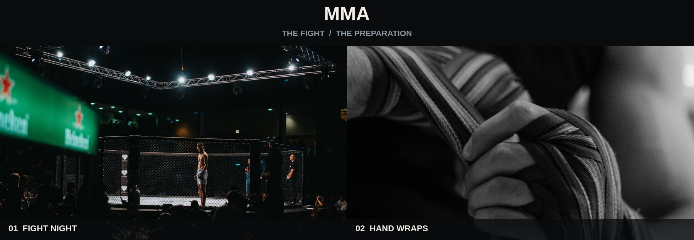

# Omarchy MMA Theme

An [Omarchy](https://omarchy.org) theme inspired by MMA.





## Install

```bash
omarchy theme install https://github.com/dtt101/omarchy-mma-theme
```

## Palette

| Role | Hex |
| --- | --- |
| Canvas | `#090B0D` |
| Dark | `#060708` |
| Surface | `#15191D` |
| Raised | `#272D32` |
| Chalk | `#F2EEE7` |
| Steel | `#929CA5` |
| Corner red | `#BE3A2F` |
| Hand-wrap gold | `#D3A24B` |

The full terminal palette is in [`colors.toml`](colors.toml). The icon theme is `Yaru-red`.

## Background provenance

The theme currently includes two edited photographs from Pexels: a live fight-night octagon and a monochrome hand-wrap close-up. Photographer and source details are listed in [`CREDITS.md`](CREDITS.md).
